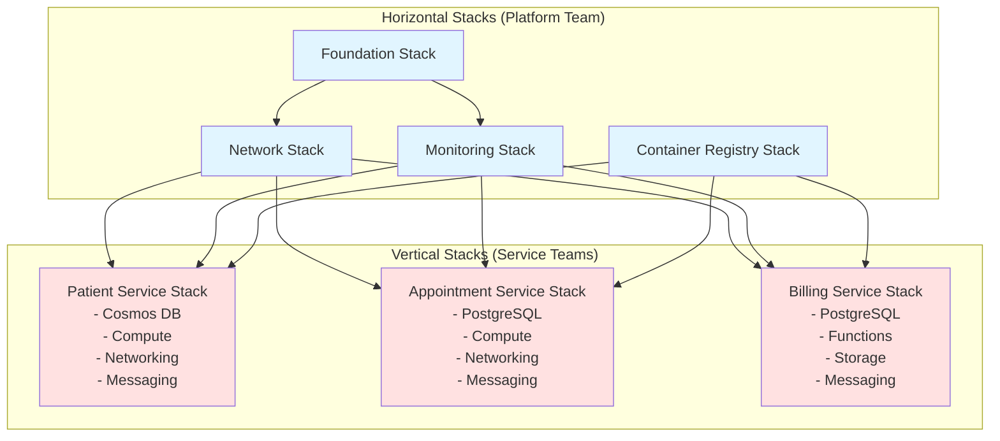

# Tillegg til Løsningsforslag: Horisontal vs Vertikal Stack-design

## Introduksjon til Horizontal og Vertical Design

Morris diskuterer i kapittel 6 to fundamentale tilnærminger til hvordan infrastruktur kan organiseres i stacks - **horisontal design** og **vertikal design**. Dette er en kritisk designbeslutning som påvirker team-autonomi, blast radius ved endringer, og hvor lett det er å skalere organisasjonen.

Vår opprinnelige løsning for HealthMonitor AS brukte primært horisontal inndeling uten å eksplisitt diskutere dette valget og alternative tilnærminger. Dette tillegget adresserer dette og viser hvorfor en **hybrid approach** er best for HealthMonitor.

---

## Horizontal Design - Lagdelt Tilnærming

### Konsept

I horizontal design organiseres infrastruktur etter **teknologi-lag** eller **infrastruktur-typer**. Morris beskriver dette som den tradisjonelle tilnærmingen hvor "networking stuff together, database stuff together, and OS stuff together".

For HealthMonitor ville en ren horisontal tilnærming se slik ut:

```
┌─────────────────────────────────────────────────────────────┐
│                    Compute Stack                            │
│  Alle compute-ressurser for alle workloads:                 │
│  - AKS cluster for alle microservices                       │
│  - App Service for frontend                                 │
│  - Functions for alle bakgrunnsjobber                       │
│  - VM Scale Sets for legacy komponenter                     │
└─────────────────────────────────────────────────────────────┘

┌─────────────────────────────────────────────────────────────┐
│                    Database Stack                           │
│  Alle databaser for alle workloads:                         │
│  - Cosmos DB for patient service                            │
│  - Cosmos DB for event logging service                      │
│  - PostgreSQL for appointment service                       │
│  - PostgreSQL for billing service                           │
└─────────────────────────────────────────────────────────────┘

┌─────────────────────────────────────────────────────────────┐
│                    Network Stack                            │
│  Alt nettverk for alle workloads:                           │
│  - VNet og alle subnets                                     │
│  - NSG regler for alle services                             │
│  - Application Gateway routing til alle services            │
│  - Private endpoints for alle services                      │
└─────────────────────────────────────────────────────────────┘
```

### Fordeler med Horizontal Design

**Enkel ressursdeling**
Når flere workloads deler samme infrastruktur-type (f.eks. alle bruker samme VNet), er det naturlig å provisjonere dem sammen. Dette sikrer at delt infrastruktur faktisk er konsistent.

**Sentralisert ekspertise**
Et dedikert database-team kan eie Database Stack og sikre at alle databaser følger best practices for backup, security, performance tuning. Dette utnytter spesialisert kompetanse effektivt.

**Enklere cross-cutting concerns**
Security policies, monitoring konfigurasjoner, og compliance-regler kan implementeres én gang på stack-nivå i stedet for å måtte dupliseres per workload.

**Mindre kode-duplisering**
En Database Stack kan bruke samme Terraform-modul for alle database-instanser med forskjellige parametere, i stedet for å ha database-kode i hver workload-stack.

### Ulemper med Horizontal Design

Morris identifiserer flere kritiske problemer med ren horisontal design:

**Stor blast radius**
Når Patient Service trenger en database-endring, må hele Database Stack endres og redeployes. Dette påvirker også Appointment Service og Billing Service sine databaser, selv om de ikke skal endres. Som Morris sier: "the scope of risk for a change to one instance is all the instances defined in the stack."

**Koordinasjonsproblemer mellom teams**
Hvis Patient Team og Appointment Team begge trenger database-endringer samme uke, må de koordinere hvem som deployer først. Dette skaper dependencies og reduserer autonomi.

**Sentralt team blir bottleneck**
Morris beskriver at løsningen ofte blir "a central team, such as a database team, own the shared database infrastructure composition. This disempowers the teams that own the services, requiring them to raise a request to the database team for even a small change, and makes the capacity of the database team a bottleneck for all the services."

For HealthMonitor betyr dette:
- Patient Team må raise en ticket til Database Team for å endre Cosmos DB-konfigurasjonen
- Database Team må prioritere requests fra alle teams
- Patient Team kan ikke selv deploye sin infrastruktur end-to-end
- Deployment lead time øker drastisk

**Vanskelig å splitte opp senere**
Når organisasjonen vokser og trenger mer team-autonomi, er det smertefullt å splitte opp horisontal stacks. Alle teams er avhengige av samme stack-kode og deployment-prosesser.

---

## Vertical Design - Workload-orientert Tilnærming

### Konsept

I vertical design organiseres infrastruktur etter **workload** eller **service**. Hver service får sin egen stack som inneholder all infrastruktur den trenger - compute, database, networking. Morris beskriver dette som alignment med moderne microservice-arkitekturer.

For HealthMonitor ville en ren vertikal tilnærming se slik ut:

```
┌─────────────────────────────────────────────────────────────┐
│              Patient Service Stack                          │
│  - AKS deployment (eller dedikert node pool)                │
│  - Cosmos DB database                                       │
│  - Subnet og NSG regler                                     │
│  - Private endpoints                                        │
│  - Service Bus topics                                       │
│  - Application Insights                                     │
└─────────────────────────────────────────────────────────────┘

┌─────────────────────────────────────────────────────────────┐
│              Appointment Service Stack                      │
│  - AKS deployment                                           │
│  - PostgreSQL database                                      │
│  - Subnet og NSG regler                                     │
│  - Private endpoints                                        │
│  - Service Bus topics                                       │
│  - Application Insights                                     │
└─────────────────────────────────────────────────────────────┘

┌─────────────────────────────────────────────────────────────┐
│              Billing Service Stack                          │
│  - Functions for billing jobs                               │
│  - PostgreSQL database                                      │
│  - Subnet og NSG regler                                     │
│  - Blob storage for invoices                                │
│  - Service Bus queue                                        │
│  - Application Insights                                     │
└─────────────────────────────────────────────────────────────┘
```

### Fordeler med Vertical Design

**Team autonomi**
Morris understreker: "having separately deployed stack instances for each service means one team can change its infrastructure's configuration without needing to coordinate with other teams and without worrying about accidentally breaking another team's infrastructure."

Patient Team kan:
- Endre sin Cosmos DB-konfigurasjon uten å påvirke andre teams
- Deploye når de vil, uten å vente på andre teams
- Eie hele stacken end-to-end fra database til compute
- Eksperimentere med nye Azure-features uten å påvirke andre

**Redusert blast radius**
Når Patient Service Stack feiler under deployment, påvirker det kun Patient Service. Appointment Service og Billing Service fortsetter å kjøre normalt.

**Aligned med organisasjonsstruktur**
Følger Conway's law - team-boundaries matcher stack-boundaries. Dette reduserer koordinasjonsbehov og øker velocity.

**Enklere å flytte ownership**
Hvis HealthMonitor beslutter å splitte Patient Service i to teams (en for patient records, en for patient monitoring), er det enkelt å også splitte stacken siden den allerede er isolert.

**Raskere feedback loops**
Mindre stacks deployer raskere. Patient Service Stack kan deploye på 10 minutter, mens en horisontal Database Stack med alle databaser kanskje tar 30 minutter.

### Ulemper med Vertical Design

**Kode-duplisering**
Morris noterer at vertical design "can unnecessarily duplicate code. For example, each stack may include code to provision a database instance." Hver service-stack må ha sin egen database-provisioning kode, NSG-konfigurasjon, monitoring setup, osv.

**Mitigering**: Bruk reusable modules! Patient Service Stack og Appointment Service Stack kan begge bruke samme `cosmos-db` modul eller `postgresql` modul.

**Vanskelig å enforces consistency**
Med horisontal design var det lett å sikre at alle databaser hadde samme backup-policy. Med vertical design må hver team implementere backup-policy i sin stack.

**Mitigering**: Bruk Azure Policy for å enforces compliance requirements uavhengig av stack-struktur.

**Potensielt høyere kostnader**
Hvis hver service får sin egen database instance, kan det være dyrere enn én delt instance. Men Morris påpeker at "IaaS and Infrastructure as Code make it simple, fast, and cheap to duplicate virtual infrastructure and to automatically resize it to match usage."

**Mer kompleks networking**
Med vertikal design må hver service sette opp sine egne private endpoints, NSG regler, osv. Dette kan føre til inkonsistent networking-konfigurasjon.

**Mitigering**: Ha shared network infrastructure (se Hybrid approach).

---

## Hybrid Approach - Best of Both Worlds

Morris anbefaler ikke ren horisontal eller ren vertikal design, men en **hybrid tilnærming** som kombinerer fordelene av begge. Han beskriver: "the shared infrastructure stack can be limited in scope, designed around a cohesive service, and deployed separately from other stack instances that contain workload-specific infrastructure."

### HealthMonitor Hybrid Design

For HealthMonitor anbefaler vi følgende hybrid approach:

#### Foundation Layer (Horizontal - Shared)

Disse stacksene provisjonerer infrastruktur som er genuint delt og sjelden endres:

**Foundation Stack**
- Azure AD integration
- Managed Identities
- Azure Policy definitions
- Defender for Cloud

**Begrunnelse**: Identity og security policies er global concerns som *må* være konsistente. Dette skal eies av Platform Team og endres sjelden.

**Network Stack (per miljø)**
- VNet og subnets
- Azure Bastion
- Application Gateway med WAF
- Core NSG rules

**Begrunnelse**: Morris sier "having two consumer infrastructure components share a provider infrastructure component is more likely to be useful when it enables them to interact." Alle services kommuniserer via samme VNet, så det er naturlig å dele denne infrastrukturen.

**Monitoring Stack (per miljø)**
- Log Analytics Workspace
- Application Insights (workspace)
- Azure Dashboard

**Begrunnelse**: Sentralisert logging og monitoring gjør det lettere å få oversikt på tvers av services. Dette er en platform capability som bør deles.

**Container Registry Stack (shared)**
- Azure Container Registry

**Begrunnelse**: Container images er miljø-agnostiske og deles naturlig på tvers av services.

#### Service Layer (Vertical - Service-specific)

Hver major service/workload får sin egen vertikal stack:

**Patient Service Stack**
```
patient-service/
├── compute (AKS deployment eller dedicated node pool)
├── data (Cosmos DB instance)
├── networking (service-specific NSG rules, private endpoints)
├── messaging (Service Bus topics for patient events)
└── monitoring (Application Insights component)
```

**Begrunnelse**: Patient Service Team eier alle aspekter av sin service's infrastruktur. De kan endre database-skjema, skalere compute, og justere monitoring uten å påvirke andre teams.

**Appointment Service Stack**
```
appointment-service/
├── compute (AKS deployment)
├── data (PostgreSQL database)
├── networking (service-specific NSG rules, private endpoints)
├── messaging (Service Bus topics for appointment events)
└── monitoring (Application Insights component)
```

**Billing Service Stack**
```
billing-service/
├── compute (Azure Functions)
├── data (PostgreSQL database)
├── storage (Blob storage for invoices)
├── networking (service-specific NSG rules, private endpoints)
├── messaging (Service Bus queue for billing jobs)
└── monitoring (Application Insights component)
```

### Stack Dependency Diagram - Hybrid Approach

```
         ┌─────────────────────────┐
         │   Foundation Stack      │ ◄─── Eies av Platform Team
         │   (Horizontal - Shared) │
         └────────────┬────────────┘
                      │
      ┌───────────────┼───────────────┐
      │               │               │
┌─────▼──────┐  ┌────▼─────┐  ┌──────▼──────┐
│ Network    │  │Monitoring│  │   ACR       │ ◄─── Shared horizontal stacks
│ Stack      │  │ Stack    │  │   Stack     │
└─────┬──────┘  └────┬─────┘  └──────┬──────┘
      │              │                │
      └──────┬───────┴────────┬───────┘
             │                │
    ┌────────┼────────────────┼─────────────┐
    │        │                │             │
┌───▼────────▼───┐  ┌────────▼─────────┐  ┌▼──────────────┐
│ Patient        │  │ Appointment      │  │ Billing       │ ◄─── Vertical stacks
│ Service Stack  │  │ Service Stack    │  │ Service Stack │      (per service)
│                │  │                  │  │               │
│ - Compute      │  │ - Compute        │  │ - Compute     │
│ - Cosmos DB    │  │ - PostgreSQL     │  │ - PostgreSQL  │
│ - Networking   │  │ - Networking     │  │ - Storage     │
│ - Messaging    │  │ - Messaging      │  │ - Messaging   │
│ - Monitoring   │  │ - Monitoring     │  │ - Monitoring  │
└────────────────┘  └──────────────────┘  └───────────────┘
     ▲                    ▲                      ▲
     │                    │                      │
     └────────────────────┴──────────────────────┘
              Eies av respektive service teams
```

### Når Bruker Vi Hva?

Morris gir noen heuristikker for å bestemme horisontal vs vertikal:

**Bruk horizontal (shared) stack når:**
- Ressursene genuint må deles for interoperabilitet (f.eks. VNet for kommunikasjon)
- Sentralisert kontroll er nødvendig for compliance (f.eks. Azure Policy)
- Ressursene endres svært sjelden (f.eks. Foundation)
- Spesialisert ekspertise er nødvendig (f.eks. networking team)

**Bruk vertical (service-specific) stack når:**
- Ressursen er dedikert til én service/workload
- Ulike teams skal kunne endre uavhengig
- Deployment-hastighet er viktigere enn delt administrasjon
- Services har forskjellige SLA/compliance-krav

### Implementering av Hybrid Approach

#### Kode-organisering

```
healthmonitor-infrastructure/
├── shared-stacks/              # Horizontal stacks
│   ├── foundation/
│   ├── network/
│   ├── monitoring/
│   └── acr/
│
├── service-stacks/             # Vertical stacks
│   ├── patient-service/
│   │   ├── compute.tf
│   │   ├── database.tf
│   │   ├── networking.tf
│   │   ├── messaging.tf
│   │   └── monitoring.tf
│   │
│   ├── appointment-service/
│   │   ├── compute.tf
│   │   ├── database.tf
│   │   ├── networking.tf
│   │   ├── messaging.tf
│   │   └── monitoring.tf
│   │
│   └── billing-service/
│       ├── compute.tf
│       ├── database.tf
│       ├── storage.tf
│       ├── networking.tf
│       ├── messaging.tf
│       └── monitoring.tf
│
└── modules/                    # Reusable modules
    ├── cosmos-db/              # Used by multiple vertical stacks
    ├── postgresql/             # Used by multiple vertical stacks
    ├── service-bus-topic/      # Used by multiple vertical stacks
    └── app-insights-component/ # Used by multiple vertical stacks
```

#### Team Ownership Model

```
┌────────────────────────────────────────────────────────┐
│              Platform Team                             │
│  Eier: Foundation, Network, Monitoring, ACR            │
│  Ansvar: Shared infrastructure og platform capabilities│
└────────────────────────────────────────────────────────┘

┌───────────────────┐  ┌──────────────────┐  ┌──────────────────┐
│  Patient Team     │  │ Appointment Team │  │  Billing Team    │
│  Eier: Patient    │  │ Eier: Appointment│  │  Eier: Billing   │
│  Service Stack    │  │ Service Stack    │  │  Service Stack   │
└───────────────────┘  └──────────────────┘  └──────────────────┘
```

**Platform Team** (stream-aligned team i Team Topologies-terminologi):
- Provisjonerer og vedlikeholder shared horizontal stacks
- Gir self-service capabilities til service teams
- Definerer og enforcer platform standards
- Mindre team (2-4 personer)

**Service Teams** (stream-aligned teams):
- Eier sine vertikale service stacks end-to-end
- Bruker shared horizontal stacks via remote state lookup
- Kan deploye uavhengig av andre teams
- Full autonomi innenfor platform guardrails

### Eksempel: Legge til Ny Service

Når HealthMonitor vil legge til en ny "Prescription Service":

**Med ren horizontal design** (opprinnelig løsning):
1. Database Team må legge til PostgreSQL instance i Database Stack
2. Network Team må legge til NSG regler i Network Stack
3. Compute Team må legge til AKS deployment i Compute Stack
4. Monitoring Team må legge til App Insights component
5. Alle endringer må koordineres og testes sammen
6. Deployment påvirker alle eksisterende services
7. **Estimert tid: 2-4 uker med koordinasjon**

**Med hybrid design**:
1. Prescription Team lager ny `prescription-service/` stack
2. Stack bruker shared Network, Monitoring, og ACR stacks via remote state
3. Stack provisjonerer sin egen database, compute, messaging
4. Team tester og deployer uavhengig
5. Ingen impact på eksisterende services
6. **Estimert tid: 3-5 dager uten koordinasjon**

### Mitigering av Vertical Design Ulemper

**Problem: Kode-duplisering**
```hcl
# patient-service/database.tf
module "cosmos_db" {
  source = "../../modules/cosmos-db"
  
  service_name = "patient"
  databases = [
    { name = "patients", throughput = 400 },
    { name = "medical-records", throughput = 1000 }
  ]
}

# appointment-service/database.tf  
module "postgresql" {
  source = "../../modules/postgresql"
  
  service_name = "appointment"
  databases = ["appointments", "calendars"]
}
```
**Løsning**: Reusable modules eliminerer code duplication. Kun parametre er forskjellige.

**Problem: Inkonsistent konfigurasjon**
```hcl
# Azure Policy enforces backup på alle databaser
resource "azurerm_policy_assignment" "require_database_backup" {
  name                 = "require-database-backup"
  scope                = data.azurerm_subscription.current.id
  policy_definition_id = azurerm_policy_definition.database_backup.id
}
```
**Løsning**: Azure Policy i Foundation Stack enforcer compliance uavhengig av hvilken stack som provisjonerer ressursen.

**Problem: Kompleks networking**
```hcl
# patient-service/networking.tf
data "terraform_remote_state" "network" {
  backend = "azurerm"
  config = {
    key = "network-${var.environment}.tfstate"
  }
}

resource "azurerm_subnet" "patient_service" {
  name                 = "snet-patient-${var.environment}"
  virtual_network_name = data.terraform_remote_state.network.outputs.vnet_name
  address_prefixes     = ["10.0.10.0/24"]
}
```
**Løsning**: Services lager sine egne subnets i shared VNet. Network Stack gir kun VNet, services får autonomi over sine subnets.

---

## Oppdatert Løsning for HealthMonitor

### Revidert Stack-inndeling

**Horizontal Stacks (Shared - Platform Team)**:
1. Foundation Stack - Identity, policies, security baseline
2. Network Stack - VNet, Application Gateway, Bastion
3. Monitoring Stack - Log Analytics, centralized dashboards
4. Container Registry Stack - Shared ACR

**Vertical Stacks (Service-specific - Service Teams)**:
5. Patient Service Stack - Cosmos DB, compute, service networking, messaging
6. Appointment Service Stack - PostgreSQL, compute, service networking, messaging
7. Billing Service Stack - PostgreSQL, Functions, storage, service networking
8. Medical Records Service Stack - Cosmos DB, compute, service networking
9. Prescription Service Stack - PostgreSQL, compute, service networking

### Deployment Dependencies - Oppdatert

**Phase 1: Platform Foundation** (Platform Team)
```bash
./deploy-stack.sh foundation prod
./deploy-stack.sh network prod
./deploy-stack.sh monitoring prod
./deploy-stack.sh acr prod
```

**Phase 2: Services** (Parallelt av service teams)
```bash
# Patient Team deployer
./deploy-stack.sh patient-service prod &

# Appointment Team deployer  
./deploy-stack.sh appointment-service prod &

# Billing Team deployer
./deploy-stack.sh billing-service prod &

wait
```

Services kan deploye parallelt fordi de ikke avhenger av hverandre!

### Team Workflows

**Platform Team Workflow**:
```bash
# Sjeldne endringer til shared stacks
cd shared-stacks/network
terraform plan -var-file=environments/prod.tfvars

# Må koordinere med alle service teams siden endringer påvirker alle
# Sender notifikasjon: "Network Stack deployment scheduled for Tuesday 10:00"
```

**Service Team Workflow** (f.eks. Patient Team):
```bash
# Hyppige endringer til egen stack
cd service-stacks/patient-service
terraform plan -var-file=environments/prod.tfvars

# Ingen koordinasjon nødvendig - deployer når som helst!
terraform apply -auto-approve
```

---

## Konklusjon: Hvorfor Hybrid er Riktig for HealthMonitor

Morris' hybrid approach er optimal for HealthMonitor fordi:

1. **Platform capabilities som er genuint delt** (networking, monitoring) provisjoneres horisontalt for consistency og efficiency

2. **Service-spesifikk infrastruktur** (databaser, compute, messaging per service) provisjoneres vertikalt for team autonomy og rapid iteration

3. **Skalering av organisasjonen** blir mulig - nye teams kan legge til nye services uten å påvirke eksisterende teams

4. **Deployment velocity** øker drastisk - service teams venter ikke på platform team for hver endring

5. **Blast radius** reduseres - en feil i Patient Service Stack påvirker ikke Appointment Service

6. **Reusable modules** eliminerer code duplication i vertical stacks

7. **Azure Policy** enforcer compliance consistency selv med distributed ownership

Dette er i tråd med Morris' konklusjon: "organizing the infrastructure code to align with workloads" gir best team autonomy, mens "shared infrastructure stack can be limited in scope, designed around a cohesive service" håndterer genuine shared concerns.

---

## Oppdatert Visualisering

### Stack Dependency Graf - Hybrid Design



### Design Decision Matrix

| Aspect | Horizontal | Vertical | Hybrid (Chosen) |
|--------|-----------|----------|-----------------|
| Team Autonomy | ❌ Low - Central team bottleneck | ✅ High - Full ownership | ✅ High - Service autonomy with platform support |
| Blast Radius | ❌ Large - Change affects all | ✅ Small - Isolated per service | ✅ Small for services, managed for shared |
| Code Duplication | ✅ Minimal | ❌ High | ✅ Low with modules |
| Consistency | ✅ High - Centralized control | ❌ Risk of divergence | ✅ High - Policy enforced |
| Deployment Speed | ❌ Slow - Coordination needed | ✅ Fast - Independent | ✅ Fast for services |
| Organizational Scale | ❌ Poor - Teams blocked | ✅ Excellent | ✅ Excellent |
| Ops Complexity | ✅ Lower - Fewer stacks | ❌ Higher - Many stacks | ⚠️ Moderate |

Dette tillegget bør integreres i Del 1 av løsningsforslaget etter "Stack-design og Architectural Quanta".
