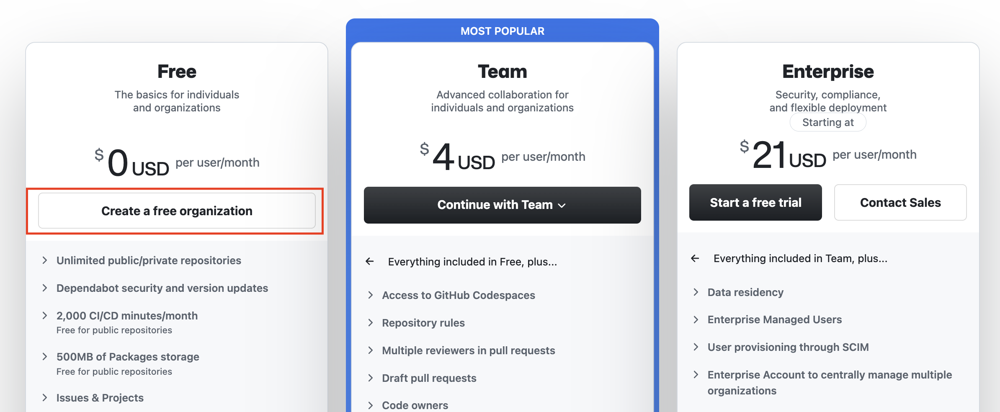

# Veiviser: Opprettelse av GitHub-organisasjon, repository og environments

Denne veiviseren viser deg hvordan du setter opp en organisasjon i GitHub, oppretter et repository og konfigurerer environments og secrets for bruk med Azure.

---

## 1. Opprett en organisasjon
1. Gå til [https://github.com/organizations/new](https://github.com/organizations/new).
2. Velg **Free**-plan.
   1. 
3. Skriv inn et ønsket unikt navn på organisasjonen (kan være hva som helst, kom på en eksempelorganisasjon).
4. Fullfør opprettelsen.

---

## 2. Opprett et nytt repository
1. Gå inn i organisasjonen din.
2. Klikk på **New** for å opprette et nytt repository.
3. Gi repository et navn (f.eks. `terraform-demo`).
4. Velg **Public** eller **Private** etter behov.
5. Kryss av for **Add a README file**.
6. Klikk på **Create repository**.

---

## 3. Opprett environments (dev, test, prod)
1. Gå inn i repository.
2. Klikk på **Settings** → **Environments**.
3. Klikk på **New environment**.
   - Gi navnet `dev`.
   - Lagre.
4. Gjenta prosessen og opprett environments `test` og `prod`.

---

## 4. Legg til Repository Secrets
For å kunne bruke GitHub Actions mot Azure, må du legge inn nødvendige secrets.

1. Gå til repository → **Settings** → **Secrets and variables** → **Actions**.
2. Klikk **New repository secret**.
3. Opprett følgende secrets (navn må være nøyaktig som skrevet under):
   - `AZURE_CLIENT_ID` → Lim inn Client ID fra Azure.
   - `AZURE_SUBSCRIPTION_ID` → Lim inn Subscription ID fra Azure.
   - `AZURE_TENANT_ID` → Lim inn Tenant ID fra Azure.
4. Nå kan workflow-filer bruke disse secrets i GitHub Actions.

---

✅ Du har nå:
- En organisasjon
- Et repository
- Tre environments (`dev`, `test`, `prod`)
- Repository secrets for Azure

Neste steg blir å koble dette opp mot Terraform og Azure via GitHub Actions.
